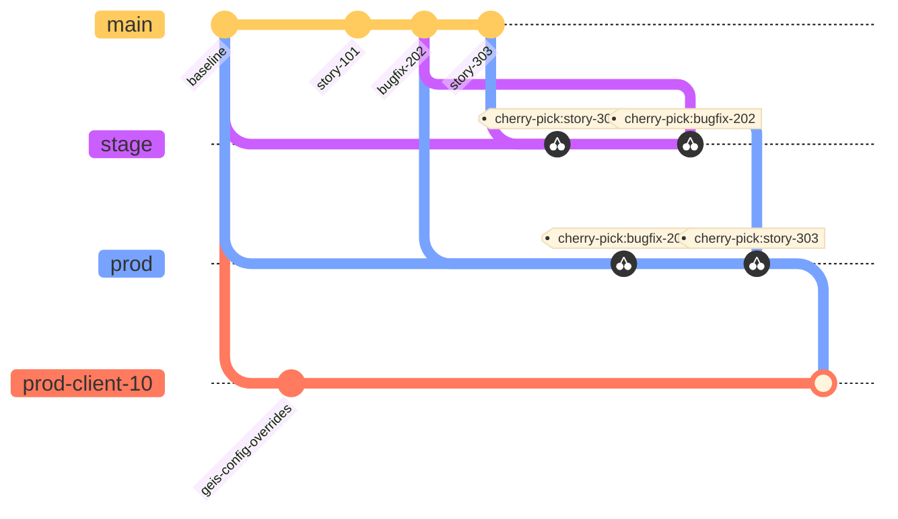
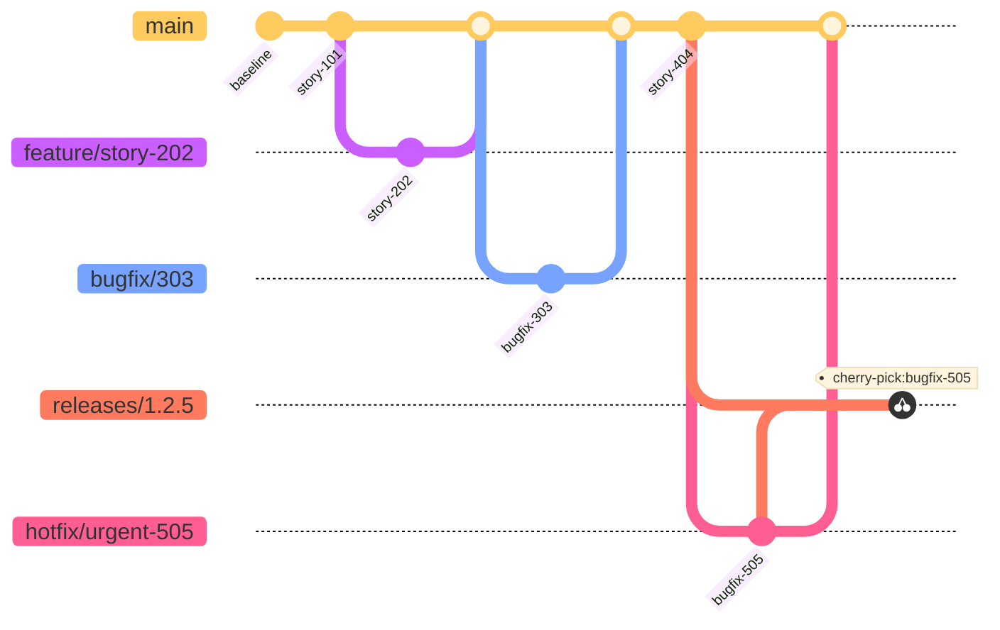

# ADR-002 Monorepo migration and branching workflow

| Field             | Value                          |
|-------------------|--------------------------------|
| Status            | Proposed                       |
| Date              | 1992-04-19                     |
| Decision Makers   | Ton, Jerry                     |
| Technical Area    | Development                    |

## Context

* The codebase has 8 main components spread across 17 repositories.
* Each of these 8 components includes between 3 and 6 submodules.
* When recursively cloning, this expands to 45 repositories.
* A specific repository (for example `common-frontend-submodule`) can be at different versions in different folders.
* A single story or bugfix often requires changes in 3 or more repositories, and therefore 3 merge requests and reviews.
* Searching within the codebase for a definition may reveal the same file in up to 8 locations.
* AI review tools can't have the full context of a change.
* AI agent code assistants can't make sense of all the duplicated code.
* AI agent code assistants can't make effective use of git worktrees.
* CI/CD pipeline definitions are spread (mostly duplicated) across 8 repositories, making improvements challenging and requiring coordination.
* Dependencies are spread across multiple repositories, making security audits and upgrades challenging.
* Customer-specific customization branches are required for the 8 main services.
* The `prod` branch is merged onto these customization branches on different schedules based on business needs.
* Stories are cherry-picked (across multiple repositories) from `develop` to `stage` and then to `prod` out of order based on business needs.

Current submodule structure
```
modules/
├─ admin-panel/
│  └─ src/submodules/
│     ├─ common-frontend-submodule/ 🟦
│     ├─ frontend-app-microservice-submodule/ 🟨
│     ├─ frontend-notification-microservice-submodule/ 🟧
│     ├─ frontend-sso-microservice-submodule/ 🟪
│     └─ frontend-worklist-microservice-submodule/ 🟤
├─ application-ms/
│  └─ src/submodules/
│     ├─ common-db-storage-microservice-submodule/ 🟥
│     ├─ common-frontend-submodule/ 🟦
│     ├─ common-microservice-submodule/ 🟩
│     ├─ frontend-app-microservice-submodule/ 🟨
│     ├─ frontend-notification-microservice-submodule/ 🟧
│     └─ main-db-infrastructure-submodule/ 🟫
├─ database-storage-ms/
│  └─ src/submodules/
│     ├─ common-db-storage-microservice-submodule/ 🟥
│     ├─ common-frontend-submodule/ 🟦
│     ├─ common-microservice-submodule/ 🟩
│     ├─ frontend-db-storage-microservice-submodule/
│     ├─ frontend-notification-microservice-submodule/ 🟧
│     └─ main-db-infrastructure-submodule/ 🟫
├─ hl7-to-exam-ms/
│  └─ src/submodules/
│     ├─ common-frontend-submodule/ 🟦
│     ├─ common-microservice-submodule/ 🟩
│     └─ frontend-notification-microservice-submodule/ 🟧
├─ notification-ms/
│  └─ src/submodules/
│     ├─ common-db-storage-microservice-submodule/ 🟥
│     ├─ common-frontend-submodule/ 🟦
│     ├─ common-microservice-submodule/ 🟩
│     ├─ frontend-notification-microservice-submodule/ 🟧
│     └─ main-db-infrastructure-submodule/ 🟫
├─ parsing-ms/
│  └─ src/submodules/
│     ├─ common-frontend-submodule/ 🟦
│     ├─ common-microservice-submodule/ 🟩
│     └─ tenant-db-infrastructure-submodule/
├─ sso-ms/
│  └─ src/submodules/
│     ├─ common-frontend-submodule/ 🟦
│     ├─ common-microservice-submodule/ 🟩
│     ├─ frontend-sso-microservice-submodule/ 🟪
│     └─ main-db-infrastructure-submodule/ 🟫
└─ worklist-ms/
   └─ src/submodules/
      ├─ common-db-storage-microservice-submodule/ 🟥
      ├─ common-frontend-submodule/ 🟦
      ├─ common-microservice-submodule/ 🟩
      ├─ frontend-worklist-microservice-submodule/ 🟤
      └─ main-db-infrastructure-submodule/ 🟫
```



The main microservices modules and the frontend (`admin-panel`) have these branches
* `develop`
* `stage`
* `pre-prod`
* `prod`
* `prod-client-1`
* `prod-client-2`
* `prod-client-10`
* `prod-client-3`
* `prod-client-4`
* `prod-client-5`
* `prod-client-6`
* `prod-client-7`

Nested submodules have `develop`, `stage`, `pre-prod`, and `prod`, but no customer-specific branches.

## Decision

Migrate to a monorepo, adopt trunk-based workflow on `main`, create versioned releases, and use ephemeral environments for MRs. Replace customer branches with Parameter Store-backed configuration.

### Monorepo + Trunk-based + AWS parameter store + Application state repo

Details
* Create a single monorepo with clear domains: `services/`, `frontends/`, `common/`, and `infra/`.
* Convert current submodules into in-repo packages/workspaces under `common/`.
* Use `main` as trunk. Short-lived `feature/*`, `bugfix/*`, and `hotfix/*` branches. Use `releases/*` branches only for stabilization.
* Release cadence is every two weeks.
* Apply a strict cherry-pick policy: fixes land on `main` first, then are cherry-picked into `releases/*` only as needed for stabilization. Avoid cherry-picking from `releases/*` back to `main` except in emergencies.
* Replace customer branches with Parameter Store-backed configuration and application state repo.
* Standardize CI/CD with shared pipeline templates and per-service jobs.
* The application state (env customization, which versions is deployed where) and CD will be handled in a seperate repository. This monorepo will only produce versionned docker images.


Propose folder structure:
```
.
├── common
│   ├── common-db-storage-microservice-submodule
│   ├── common-frontend-submodule
│   ├── common-microservice-submodule
│   ├── frontend-app-microservice-submodule
│   ├── frontend-db-storage-microservice-submodule
│   ├── frontend-notification-microservice-submodule
│   ├── frontend-sso-microservice-submodule
│   ├── frontend-worklist-microservice-submodule
│   ├── main-db-infrastructure-submodule
│   └── tenant-db-infrastructure-submodule
├── docker-compose.yaml
├── frontend
│   └── admin-panel
└── service
    ├── app-ms
    ├── db-ms
    ├── hl7-ms
    ├── ns-ms
    ├── ps-ms
    ├── sso-ms
    └── wl-ms
```




Pros
* Eliminates version skew across submodules and duplicated code copies.
* Reduces change overhead to a single PR for cross-cutting work.
* Makes code search, audits, and AI-assisted reviews effective.
* Simplifies dependency management and security upgrades.
* Enables consistent, reusable CI/CD and release workflows.

Cons
* Migration effort and temporary workflow disruption.
* Requires stricter trunk discipline and stronger CI gates.
* Some customer deltas may require additional configuration work upfront.

## Consequences

* Short-term migration work is required to consolidate repositories and pipelines.
* Teams will shift to `main`-based development with stronger testing gates.
* Customer-specific behavior will move to Parameter Store.
* Promotions will move to the same build across environments, with configuration controlling differences.
* Release flow shifts from cherry-pick-heavy promotion to promoting the same commit/build across environments, with configuration controlling differences.

## Migration Plan (High Level)

1. Create monorepo skeleton.
2. Import common submodules into `common/` as packages.
3. Define config schema and customer migration plan.
4. Consolidate/Re-implement CI/CD pipeline.
5. Deprecate old repos and remove submodules.

## Potential next steps (not subject to current ADR)

* Provision temporary environments per MR with seeded, expose via Twingate and auto-destroyed on merge.
* Adopt AI reviewing and agentic coding tools.
* Move to bun for package management and bundling.

## Resources

- Links to related documents, discussion, or research
- Relevant tickets or issues
- Related ADRs
