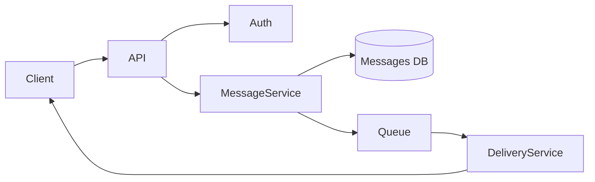
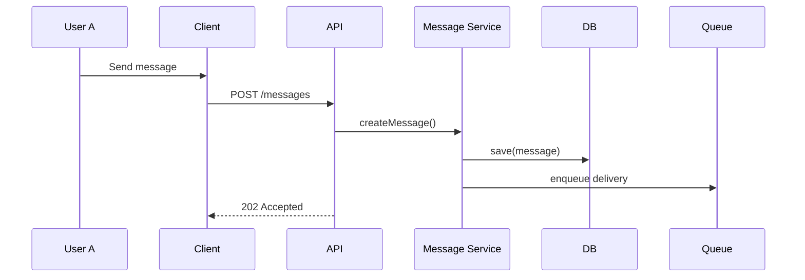
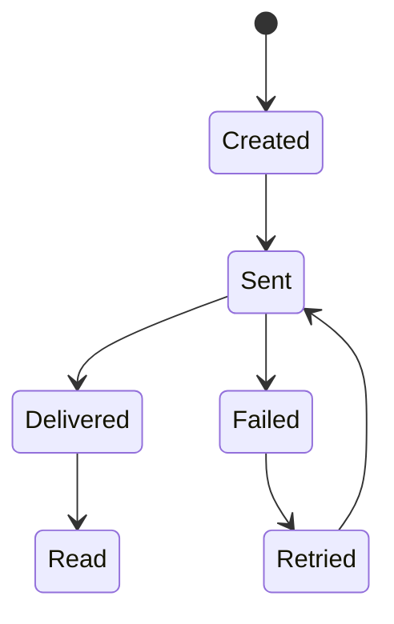

# 🧪 Laboratory Work 1
## Designing a Messaging System

### 🎯 Goal
Learn how to:
- design software systems before coding;
- reason about architecture and responsibilities;
- use Component, Sequence, and State diagrams;
- document decisions using RFC and ADR.

---

## 🧠 Context

You are designing a **minimal messenger system** that supports:
- sending messages between users;
- asynchronous delivery;
- message statuses (sent / delivered / read);
- offline users.

❗ No code is required. You act as a **system designer / tech lead**.

---

## 🧩 Functional Requirements

1. A user can send a message to another user.
2. Each message has a lifecycle.
3. The system must:
   - store messages,
   - deliver them asynchronously,
   - update delivery status.
4. The recipient may be online or offline.

---

## 🧱 Part 1 — Component Diagram (30%)

### Task
Create a **Component Diagram** that shows:
- system components,
- their responsibilities,
- interactions between them.

### Required components
- Client (Web / Mobile)
- Backend API
- Message Service
- Database
- Delivery mechanism (Queue / WebSocket / Push)

### Example (Mermaid)



---

## 🔁 Part 2 — Sequence Diagram (25%)

### Scenario
User **A sends a message** to user **B who is offline**.

### Task
Describe the interaction sequence in time.



---

## 🔄 Part 3 — State Diagram (20%)

### Object
`Message`

### Task
Describe the **message lifecycle**.



---

## 📝 Part 4 — RFC (Request for Comments) (15%)

### Task
Write a **short RFC (up to 1 page)** on the topic:

> Message delivery strategy for online and offline users

### RFC Template

```markdown
# RFC: Message Delivery Strategy

## Context
Users can be online or offline when messages are sent.

## Problem
Messages must not be lost and delivery status must be reliable.

## Proposed Solution
Use asynchronous delivery with a queue and client acknowledgements.

## Alternatives
- Direct delivery only (rejected)
- Client polling (considered)

## Consequences
+ Reliable delivery
- Increased system complexity
```

---

## 📚 Part 5 — ADR (Architecture Decision Record) (10%)

### Task
Document **one architecture decision**.

```markdown
# ADR-001: Use Message Queue for Delivery

## Status
Accepted

## Decision
Message delivery will be handled asynchronously using a queue.

## Consequences
- Messages survive client disconnects
- Higher reliability
- More infrastructure complexity
```

---


# 🧪 Laboratory Variants — Messenger System Design

Each student (or team) chooses **one variant**.  
For the chosen variant, you must deliver:

- Component Diagram  
- Sequence Diagram (one key scenario)  
- State Diagram (one main entity)  
- 1 RFC **or** 1 ADR  

---

## 🔹 Variant 1 — Basic One-to-One Messaging -> Do not do this variant!!! This is the example.
**Focus:** basic system architecture

**Requirements:**
- One user sends messages to another user
- No group chats
- Online and offline users supported

**Key questions:**
- Where are messages stored?
- How is delivery guaranteed?

---

## 🔹 Variant 2 — Message Status Tracking
**Focus:** state machine and lifecycle

**Additional requirements:**
- Message statuses: `sent`, `delivered`, `read`
- Client acknowledgements

**Key questions:**
- Who updates message status?
- What happens if acknowledgements are missing?

---

## 🔹 Variant 3 — Offline Message Delivery
**Focus:** asynchronous delivery

**Additional requirements:**
- Users can be offline for long periods
- Messages must not be lost

**Key questions:**
- Queue vs polling
- Retry strategy

---

## 🔹 Variant 4 — Group Chat
**Focus:** scaling delivery logic

**Additional requirements:**
- Messages sent to multiple recipients
- Separate delivery status per recipient

**Key questions:**
- Fan-out strategy
- Performance implications

---

## 🔹 Variant 5 — Read Receipts & Typing Indicators
**Focus:** real-time communication

**Additional requirements:**
- "User is typing…" indicator
- "Seen by…" receipts

**Key questions:**
- WebSocket vs HTTP
- Should real-time events be persisted?

---

## 🔹 Variant 6 — Message Editing & Deletion
**Focus:** consistency and auditability

**Additional requirements:**
- Edit sent messages
- Delete messages: "for me" vs "for everyone"

**Key questions:**
- Mutable vs immutable messages
- Audit trail design

---

## 🔹 Variant 7 — Message Attachments (Files / Images)
**Focus:** integrations and storage

**Additional requirements:**
- Files are not stored directly in the database
- Asynchronous upload and delivery

**Key questions:**
- External storage (e.g., S3-like)
- Virus scanning and lifecycle

---

## 🔹 Variant 8 — End-to-End Encryption (Conceptual)
**Focus:** security and privacy

**Additional requirements:**
- Server cannot read message content
- Encryption keys exist only on clients

**Key questions:**
- What data can the server store?
- What features become limited or impossible?

---

## 🔹 Variant 9 — Message Search & History
**Focus:** data access and performance

**Additional requirements:**
- Search through message history
- Pagination support

**Key questions:**
- Indexing strategy
- Privacy and consistency trade-offs

---

## 🔹 Variant 10 — Moderation & Reporting
**Focus:** business logic and governance

**Additional requirements:**
- Users can report messages
- Moderators can hide or review content

**Key questions:**
- Soft delete vs hard delete
- Audit trail and role separation

---

## 🎓 Notes for Students
All variants use the same domain (messenger),  
but emphasize **different engineering trade-offs**.

Your goal is not to design a perfect system,  
but to **clearly explain your decisions and reasoning**.


## 🎓 Final Note
If you can clearly explain your system with diagrams and decisions,
you are already thinking like a professional software engineer.
    
