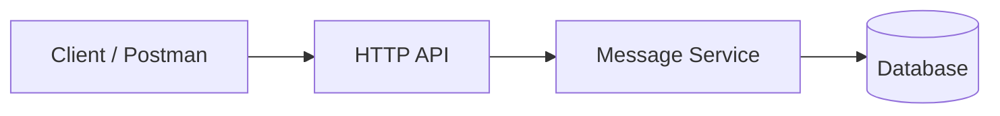
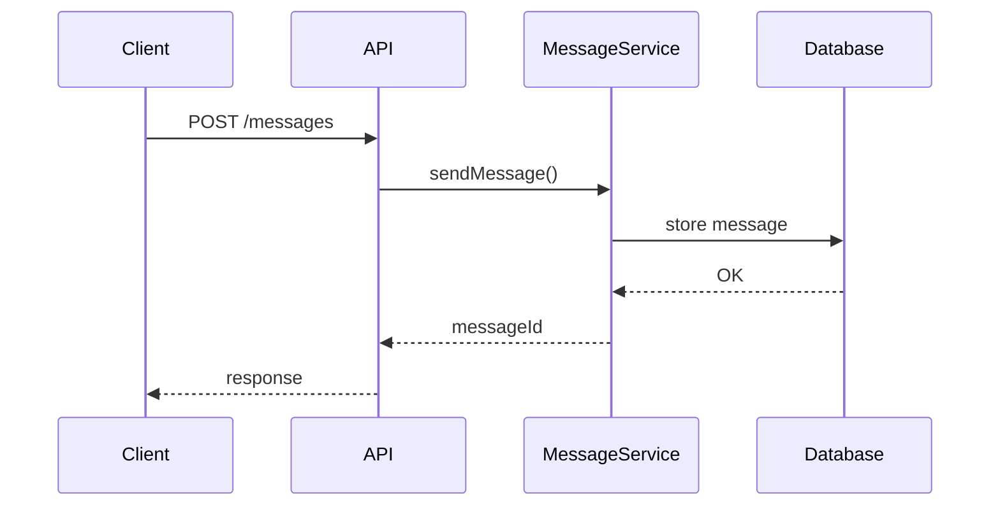

# Laboratory Work 2
## Messenger Implementation

**Course:** Software Design and Documentation  
**Prerequisite:** Lab 1 – System Design  
https://github.com/rmalkevy/Software-Design-and-Documentation/blob/main/lab-1.md

---

# Goal

The goal of this laboratory work is to **implement a working prototype of a messenger system** based on the design created in **Lab 1**.

Students will:
- continue working with the messenger domain designed earlier
- implement a minimal but functional system
- practice software structure, persistence, and testing
- learn to test APIs using **Postman**

The objective is **not to build a full production messenger**, but to demonstrate correct **software engineering practices**.

---

# Task

Implement a **minimal messenger system** using one of the variants from Lab 1.

Students may choose **any programming language**:

- TypeScript
- Python
- C#
- Java

The implementation must follow the design created previously (Component / Sequence / State diagrams), but adjustments are allowed if justified.

---

# Variant Selection

Students must implement **one of the 10 messenger variants** from Lab 1.

Examples of variants include:

- Basic one‑to‑one messaging
- Message status tracking
- Offline message delivery
- Group chat
- Typing indicators
- Message editing
- File attachments
- End‑to‑end encryption (conceptual)
- Message search
- Moderation system

Students are free to extend functionality beyond the minimum requirements.

---

# Mandatory Features

Regardless of the chosen variant, **every implementation must include the following core elements**.

## 1. Message Persistence

Messages must be stored so that they are **not lost after the program stops**.

Possible options:

- SQLite
- PostgreSQL
- JSON / file storage

Students must clearly explain **where and how messages are stored**.

---

## 2. Unique Identifiers

Each message must contain at least:

- `messageId`
- `senderId`
- `timestamp`

This helps model real systems where entities must be uniquely identifiable.

---

## 3. Error Handling

The system must properly handle common error cases, for example:

- user does not exist
- empty message
- failed message delivery

The program should return **clear responses or error messages**.

---

## 4. Modular Code Structure

The project must be organized into logical modules or folders.

Example structure:

```
/models
/services
/storage
/api
/main
```

The goal is to demonstrate **separation of responsibilities**.

---

## 5. Simple API or CLI Interface

The system must expose a simple way to interact with it, for example:

- HTTP API
- command line interface
- simple console application
- web application

At minimum the system must support:

- send message
- read messages
- list users

---

# API Testing with Postman

Students should test their messenger using **Postman**.

Postman allows sending HTTP requests to the system and inspecting responses.

Typical workflow:

1. Start the messenger server
2. Send a request in Postman

Example request:

POST `/messages`

```
{
  "senderId": "user1",
  "receiverId": "user2",
  "text": "Hello"
}
```

3. Verify response and stored messages

Postman download:

https://www.postman.com/

Learning to test APIs with tools like Postman is an important **industry skill**.

---

# Submission Requirements

Students must submit:

### 1. Git Repository

The project must be stored in a Git repository.

Minimum requirements:

- clear commit messages
- working code

---

### 2. README File

The repository must include a README containing:

- project description
- how to run the program
- project structure
- implemented features

---

### 3. Demonstration

Students must demonstrate that the system works.

Acceptable formats:

- live demo
- screenshots of API testing in Postman

---

# Defense Questions

Students must be able to answer the following practical questions.

1. How does your system ensure that **messages are not lost**?

---

2. What happens if the **recipient is offline**?

---

3. How are **messages uniquely identified** in your system?

---

4. What **errors** can occur when sending a message and how does your system handle them?

---

5. How would your system need to change to support **1 million users**?

---

# Best Practices (Important)

The goal of this laboratory work is to practice **real software engineering**, not just coding.

### Good practices

- clear project structure
- meaningful naming
- small focused modules
- clear API design

### Things to avoid

- putting all logic in one file
- extremely long methods
- copying code from examples without understanding it

---

# Additional Advice

In professional development:

- code is stored in **Git**
- systems are tested through **APIs**
- architecture decisions matter more than syntax

Focus on writing **simple, understandable, and well‑structured code**.

A small system implemented correctly is much more valuable than a large system that does not work reliably.

---

# Minimal Reference Architecture — Educational Messenger

This document describes a **minimal reference architecture** for the messenger project used in Laboratory Work 2.

The purpose of this reference is to help students understand **how a simple messenger system can be structured**.  
It is **not a strict template** — students are free to adapt it according to their variant.

---

# System Overview

The minimal system contains three main parts:

- Client (CLI / simple UI / Postman)
- Backend API
- Database

```
Client -> HTTP API -> Message Service -> Database
```

The system should support:

- creating users
- sending messages
- retrieving message history

---

# Minimal Architecture



Components:

**Client**
- command line program
- Postman
- simple frontend

**HTTP API**
- handles incoming requests
- validates input

**Message Service**
- contains business logic
- creates and stores messages

**Database**
- stores users
- stores conversations
- stores messages

SQLite is perfectly acceptable for this project.

---

# Minimal Data Model

## User

```
User
----
id
name
```

## Conversation

```
Conversation
------------
id
type (direct | group)
```

## Message

```
Message
-------
id
conversationId
senderId
text
createdAt
```

This structure is sufficient for a basic messenger.

---

# Minimal API

The following endpoints are recommended.

## Create user

POST `/users`

Example body:

```
{
  "name": "Alice"
}
```

---

## Send message

POST `/messages`

Example body:

```
{
  "conversationId": "1",
  "senderId": "1",
  "text": "Hello"
}
```

---

## Get conversation messages

GET `/conversations/{id}/messages`

Returns message history.

---

# Example Message Flow



Steps:

1. Client sends a request
2. API validates input
3. MessageService creates message
4. Message is stored in database
5. Response returned to client

---

# Suggested Project Structure

A simple project structure could look like this:

```
/models
/services
/storage
/api
/main
```

Example:

```
/models
    user
    message
    conversation

/services
    messageService

/storage
    database

/api
    routes

/main
    application entry point
```

The goal is to keep **responsibilities separated**.

---

# Important Notes

This reference architecture intentionally keeps the system **simple**.

Students should focus on:

- clear code structure
- correct data modeling
- working functionality

A **small working system** is much better than a large unfinished one.

